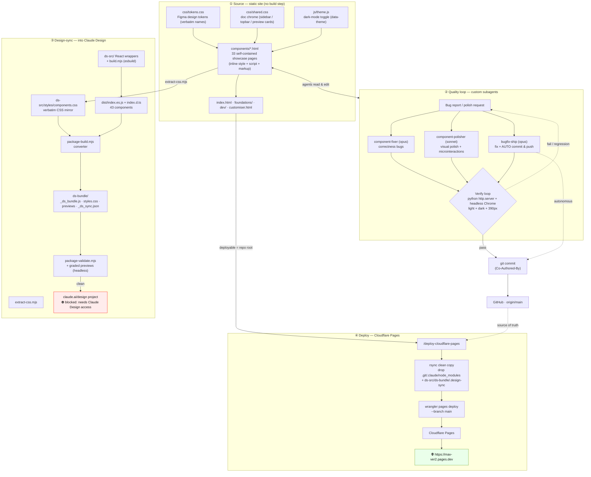

# MaV Design System — Full Working Flow

How this project works end-to-end: a hand-authored static design-system site, an
agent-driven quality loop, a design-sync pipeline into Claude Design, and a
Cloudflare Pages deploy. All four share one Git backbone (`origin/main`).

## Walkthrough

**① Source.** The repo *is* the site — no build step. `css/tokens.css` holds the
Figma design tokens (names kept verbatim, slashes/typos preserved);
`css/shared.css` is doc-page chrome; `js/theme.js` drives dark mode via
`[data-theme]`. Each `components/*.html` is a self-contained showcase page with
inline `<style>`/`<script>`, plus `index.html`, `foundations/`, `dev/`, and
`customiser.html`.

**② Quality loop.** A bug or polish request routes to one of three project
subagents (`.claude/agents/`): **component-fixer** (opus) for correctness bugs,
**component-polisher** (sonnet) for visual polish/microinteractions, and
**bugfix-ship** (opus) which fixes *and* commits/pushes autonomously. Every fix
passes the same gate — reproduce and verify with headless Chrome in light, dark,
and phone width — before it's committed with a co-author line and pushed to
`origin/main`. (Agents load at Claude Code startup.)

**③ Design-sync.** To make the system usable inside Claude Design, `extract-css.mjs`
mirrors every page's CSS verbatim into `ds-src/styles/components.css`; thin React
wrappers in `ds-src/` compile via esbuild to `dist/` (43 components + `.d.ts`); the
`package-build.mjs` converter emits `ds-bundle/` (`_ds_bundle.js`, `styles.css`,
graded preview cards, `_ds_sync.json`); `package-validate.mjs` gates it. Upload to
a `claude.ai/design` project is the final step — currently **blocked** pending
Claude Design access on the account.

**④ Deploy.** `/deploy-cloudflare-pages` stages a clean copy (dropping VCS,
tooling, and design-sync build artifacts), then `wrangler pages deploy --branch main`
publishes to Cloudflare Pages at **https://mav-ver2.pages.dev**.
